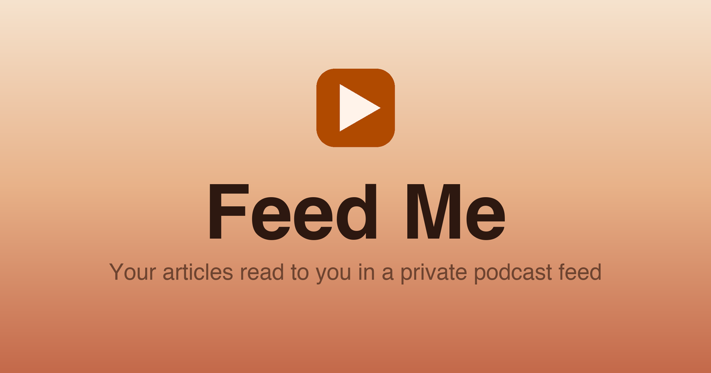

<p align="center">
  
</p>

<h1 align="center">Feed Me</h1>

<p align="center"><strong>Your articles, read to you in a private podcast feed.</strong></p>

<p align="center">
  <a href="https://feed-me.xyz">feed-me.xyz</a>
</p>

---

Got a long article you'll never sit down to read? Share it to Feed Me from your
phone and it comes back a few minutes later as a podcast episode, narrated aloud,
waiting in your feed. Listen on your commute, on a walk, doing the dishes. No new
app to babysit. It just shows up in the podcast player you already use.

## Listen in 3 steps

1. **Get your feed.** Tap *Get my feed* at [feed-me.xyz](https://feed-me.xyz).
   You get a private feed that's yours alone. Bookmark it; that link is your
   account (no password, no sign-up).
2. **Add the Shortcut + subscribe.** One tap installs the iOS Shortcut, one tap
   subscribes you in Apple Podcasts (Overcast, Pocket Casts, and friends work
   too). The page walks you through it.
3. **Share anything.** From any article, hit *Share → Feed Me*. A minute or two
   later the episode lands in your podcast app. Pin the Shortcut and it's a
   single tap forever after.

## Good to know

- **It's private.** Your feed lives at an unguessable link only you have. Keep
  that link to yourself, and don't submit it to public podcast directories.
- **Pick your voice.** Choose how the narration sounds in your feed's settings.
- **Apple Podcasts, Overcast, Pocket Casts, Castro, etc.** Anything that takes a
  normal podcast link works. Spotify doesn't (it won't accept personal feeds).
- **Bookmark your feed link.** It's the only way back in.
- **Agents welcome.** Your AI agent can add articles for you. Tap
  *For agents* on your feed page, or point your agent at
  [feed-me.xyz/AGENTS.md](https://feed-me.xyz/AGENTS.md). In a WebMCP
  browser (ChatGPT's browser, or Chrome with WebMCP enabled) the pages
  register their own tools, so the agent needs no docs at all.

---

## Under the hood

The rest of this is for the curious and for developers. Feed Me is a small
Python/FastAPI app: server-rendered, no client framework, no database (the
filesystem is the store), deployed on Fly.io.

### The flow

1. **Create a feed.** `POST /create` mints a private feed at `/u/<secret>` and
   sets a long-lived first-party cookie (`fm_session`) tying this browser to that
   feed. The secret URL is the account; there is no login.
2. **One generic iOS Shortcut** (same for everyone, no copy/paste) URL-encodes a
   shared article and opens `https://feed-me.xyz/share?url=<article>` in your
   browser.
3. **`/share` identifies you by the cookie** (nothing is baked into the
   Shortcut), writes a pending episode, and starts ingest in a background thread.
   The page shows a live progress bar that polls `/share/status`.
4. **Ingest** (`ingest.py`): fetch the article (`httpx` + `readability-lxml`),
   chunk the text at sentence boundaries, synthesize each chunk with OpenAI TTS
   (`tts-1`) in parallel, concatenate the MP3s, write the episode.
5. **Subscribe** to `/u/<secret>/feed.xml` in any podcast app.

Each feed is a directory: `/data/<secret>/` holds `settings.json` plus one
`<slug>.json` (+ `<slug>.mp3`) per episode. The secret is the credential.

### Routes

| Route | Purpose |
|-------|---------|
| `GET /` | Landing page |
| `POST /create` | Mint a feed, seed the welcome episode, set the session cookie, redirect to `/u/<secret>` |
| `GET /u/{secret}` | Feed home/settings; refreshes the cookie. Leads with the episodes table once a real article has been shared, else with setup instructions |
| `GET /share?url=` | Capture endpoint hit by the Shortcut; cookie-identified. Renders a live adding/added/failed page |
| `GET /share/status?slug=` | JSON status for one episode, polled by the `/share` page |
| `GET /share/text` | Landing page for the Full Text Shortcut: reads the article text out of the URL fragment and posts it back. Cookie-identified, so the Shortcut carries no secret |
| `POST /share/text` | Cookie-authed twin of `/u/<secret>/share-text`; renders the same live adding/added/failed page as `/share` |
| `POST /u/{secret}/share-text` | Same narration from a secret-authed client (no browser); 30/day rolling cap shared with `/share/text` |
| `POST /u/{secret}/episodes` | Agent API: create an episode from a JSON body (`{"url": ...}` or `{"text": ..., "title": ...}`); 5/day rolling cap |
| `GET /u/{secret}/episodes` | Agent API: JSON feed listing (20 most recent) + voice + remaining quota, secret-authed |
| `GET /u/{secret}/episodes/{slug}` | Agent API: JSON episode status, secret-authed |
| `DELETE /u/{secret}/episodes/{slug}` | Agent API: delete an episode (undo a share), secret-authed |
| `GET /AGENTS.md`, `GET /llms.txt` | Agent-facing API docs |
| `GET /webmcp.js` | WebMCP tool registration script, loaded by the landing and feed pages for in-browser agents |
| `GET /u/{secret}/episodes_partial` | Episode-table fragment, polled every 3s by the settings page |
| `POST /u/{secret}/voice` | Change the TTS voice (shimmer / alloy / nova / echo) |
| `POST /u/{secret}/rotate` | Rotate the secret (invalidates the old URL) |
| `GET /u/{secret}/feed.xml` | The RSS feed |
| `GET /u/{secret}/audio/{slug}.mp3` | Episode audio |
| `GET /admin/stats?token=` | Analytics dashboard (token-gated; 404 without the right `STATS_TOKEN`) |
| `GET /admin/export?token=` | Analytics JSON (summary + raw events) |
| `GET /healthz`, `/cover.jpg`, `/og.png`, `/favicon.ico`, `/favicon-32.png`, `/apple-touch-icon.png` | Health, cover art, share image, icons |

### Modules

- **`app.py`**: all FastAPI routes, the session cookie, analytics wiring.
- **`ingest.py`**: article fetch, text chunking, parallel TTS, MP3 assembly.
- **`storage.py`**: the filesystem "database" (users, episodes, settings).
- **`rss.py`**: renders the RSS feed; episode show notes link to the original article and back to the feed page.
- **`analytics.py`**: self-hosted SQLite event store (see below).
- **`templates/`**: Jinja2 (`landing`, `settings`, `share`, `admin_stats`, `feed.xml`, plus the `_episodes_section` / `_setup_instructions` partials).
- **`scripts/`**: one-off asset generators (`gen_cover`, `gen_welcome`, `gen_favicon`, `gen_og`); never run in production, outputs committed to `static/`.

### Analytics

Two tiers. **Operational stats are self-hosted**: events (`page_view`,
`feed_created`, `article_shared`) go to a SQLite DB at
`/data/_analytics/analytics.db` (its own subdir so the `/data/<secret>/` feed
level stays pure). Each event is attributed by a **one-way `sha256(secret)[:12]`
hash, never the raw secret**, so this store can never reveal a private feed
URL. `article_shared` events also store the article URL + title. Writes are
fire-and-forget and can never break a page render.

**Audience analytics are Google Analytics 4** (`templates/_ga.html`, included
by the landing, settings, and share pages; the admin page is not tracked):
device, browser, city/state/country, and referrer reporting in the GA UI.
Google receives the visitor's IP, user agent, and referrer, never the feed
secret: the settings page reports its location as `/u/_`, and any referrer
containing `/u/<secret>` is masked the same way before the config call fires.

### Environment variables

| Var | Default | Purpose |
|-----|---------|---------|
| `FEED_ME_DATA_DIR` | `/data` | Root of the filesystem store |
| `APP_BASE_URL` | `http://localhost:8000` | Public base URL (used in feed/share URLs and to gate the `Secure` cookie flag) |
| `OPENAI_API_KEY` | (required) | Text-to-speech |
| `SHORTCUT_ICLOUD_URL` | placeholder | iCloud link to the generic "Feed Me" Shortcut |
| `SHORTCUT_TEXT_ICLOUD_URL` | unset | iCloud link to the "Feed Me Full Text" Shortcut; unset hides its row on the settings page |
| `STATS_TOKEN` | unset | Gates `/admin/*`; unset means those routes 404 |

### Develop

```bash
uv sync                       # install deps (incl. the dev group: pytest, pillow)
uv run pytest                 # run the test suite
# Run locally (needs a writable data dir + a dummy or real OpenAI key):
FEED_ME_DATA_DIR=/tmp/feedme OPENAI_API_KEY=sk-... APP_BASE_URL=http://localhost:8000 \
  uv run uvicorn app:app --reload
```

Tests use fake HTTP and OpenAI clients (`tests/conftest.py`), so they make no
network calls; the `client` fixture points `DATA_DIR` at a temp dir, giving each
test an isolated store and analytics DB.

### Deploy

Hosted on Fly.io (app `feed-me-noah-willow-grove-8052`, region `sjc`, one machine
with a persistent volume at `/data`).

```bash
fly secrets set OPENAI_API_KEY=... SHORTCUT_ICLOUD_URL=... STATS_TOKEN=... \
  --app feed-me-noah-willow-grove-8052
fly deploy --app feed-me-noah-willow-grove-8052
```

`APP_BASE_URL` and `FEED_ME_DATA_DIR` are set in `fly.toml`. Releases are tagged
`vX.Y`; see `CHANGELOG.md`. Per-feature specs and plans live in
`docs/superpowers/`.

## License

MIT. See [`LICENSE`](LICENSE).
